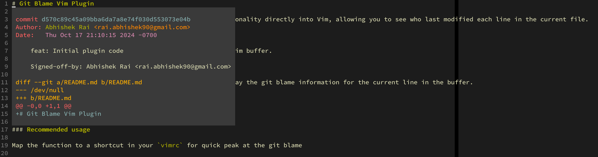

# Git Blame Vim Plugin

Git Blame is a Vim plugin that integrates `git blame` functionality directly into Vim, allowing you to see who last modified each line in the current file.

## Features

- Displays git blame information for the current line in a Vim buffer.

## Usage

Once installed, you can use the `:GitBlame` command to display the git blame information for the current line in the buffer.

```vim
:GitBlame
```

### Recommended usage

Map the function to a shortcut in your `vimrc` for quick peak at the git blame

**vim**:

```vim
nmap <silent><Leader>g :GitBlame<CR>
```

**neovim**:

```lua
vim.api.nvim_set_keymap('n', '<Leader>g', ':GitBlame<CR>', { silent = true })
```

## Preview




## Installation

### Using [Vundle](https://github.com/VundleVim/Vundle.vim)

1. Add the following line to your `.vimrc`:

    ```vim
    Plugin 'darthfork/git-blame.vim'
    ```

2. Install the plugin by running:

    ```vim
    :PluginInstall
    ```

### Using [Pathogen](https://github.com/tpope/vim-pathogen)

1. Clone the repository into your `.vim/bundle` directory:

    ```bash
    git clone https://github.com/darthfork/git-blame.vim ~/.vim/bundle/git-blame.vim
    ```

### Using [vim-plug](https://github.com/junegunn/vim-plug)

1. Add the following line to your `.vimrc`:

    ```vim
    Plug 'darthfork/git-blame.vim'
    ```

2. Install the plugin by running:

    ```vim
    :PlugInstall
    ```

### Manual Installation

1. Clone the repository:

    ```bash
    git clone https://github.com/darthfork/git-blame.vim ~/.vim/pack/plugins/start/git-blame.vim
    ```

2. Restart Vim.
